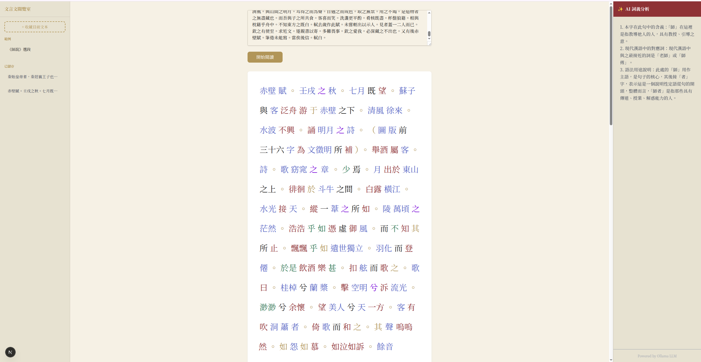
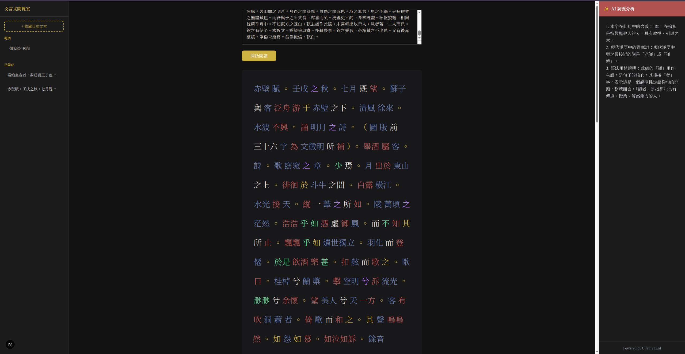
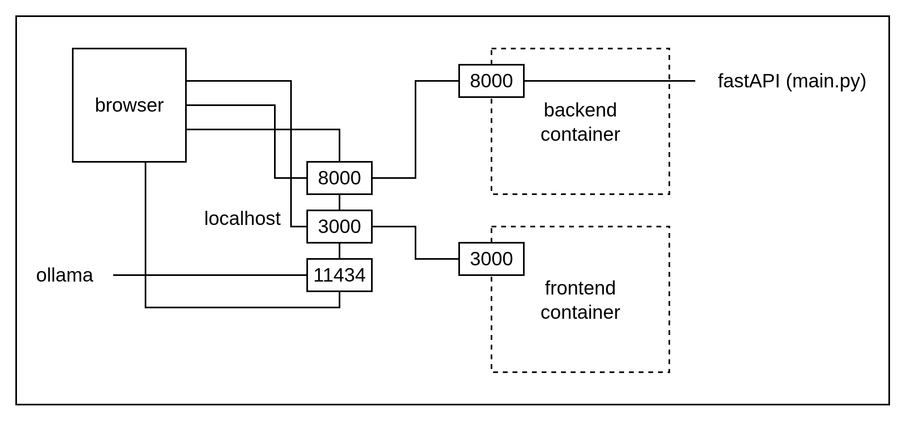
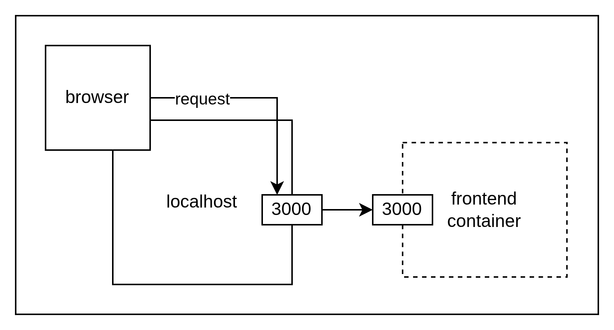
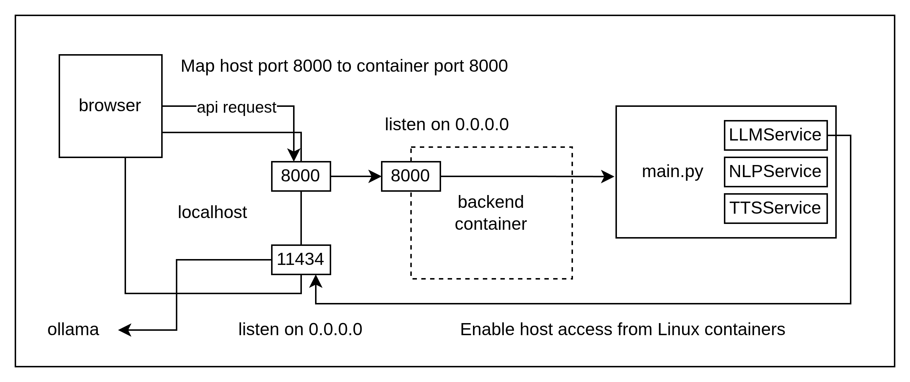

# 🏮 文言文閱覽室 (Wenyanwen Reader)

「文言文閱覽室」是一款專為古典文獻設計的智能閱讀助手。本工具整合了 `HanLP` 高精度分詞與詞性標註技術、Web Speech API 沉浸式語音合成，以及透過 Ollama 驅動 `qwen2.5:7b` 的大語言模型 (LLM) 進行深度語義解析。它能將艱澀的文言文轉化為直觀的互動學習體驗，是學生、研究者及古典文學愛好者的理想研究夥伴。

Wenyanwen Reader is an intelligent reading assistant specifically designed for Classical Chinese literature. By integrating `HanLP` for high-precision word segmentation and part-of-speech (POS) tagging, Web Speech API for immersive phonetic narration, and Large Language Models (LLMs) `qwen2.5:7b` via Ollama for contextual interpretation, this tool transforms cryptic ancient texts into an interactive learning experience. It is the perfect companion for students, scholars, and enthusiasts of classical Chinese culture.





## Mini Demo

- [colab qiuck model demo](https://colab.research.google.com/drive/1jOeWcwx8Ni0KA_Y0r_p4YUS1kBvo98D3?usp=sharing)
- [aistudio quick UI demo](https://ai.studio/apps/drive/17opMC_OzFOW--ZQ8lKf-_5qWQitouqFJ?fullscreenApplet=true)
- [light UI demo](demo/README.md)

## Usage

### 💻 Hardware & System Requirements

> Since this project runs a combination of NLP models and an AI Language Model, the requirements are higher than a standard web app.

#### 1. Recommended Hardware
| Component | Minimum | Recommended |
| :--- | :--- | :--- |
| **CPU** | Quad-core (Intel i5 / Apple M1) | 8-core (Intel i7 / Apple M2/M3) |
| **RAM** | **8 GB** | **16 GB or more** |
| **GPU** | Not required (CPU only works) | **NVIDIA GPU (6GB+ VRAM)** or **Apple Silicon** |
| **Storage** | 10 GB free space | 20 GB free space (for Models) |

*   **Why 8GB+ RAM?** 
    *   **HanLP:** Uses a Transformer-based model (Electra) which requires ~1-2GB of RAM.
    *   **Ollama (LLM):** If running a 7B-8B parameter model (like Llama 3 or Qwen 2.5), it requires at least 4.5GB to 5GB of RAM just for the model weights.
    *   **Docker:** Docker itself consumes resources to manage three containers simultaneously.

#### 2. Software Requirements
*   **Docker Desktop** (Windows/Mac) or **Docker Engine** (Linux).
*   **Ollama** (Installed on the host machine to utilize GPU acceleration).

#### 3. Network Requirements
*   **Internet Access:** 
    *   Required for the **initial build** (to download Docker images and HanLP models).

#### 4. Verified Environment
*   **Windows 10/11:** Use WSL2 backend for Docker.
*   **macOS:** Works natively on Intel and Apple Silicon (M1/M2/M3).
*   **Linux:** Ubuntu 20.04+ recommended.

### **Prerequisites**

1. install ollama from official site https://ollama.com/download
2. pull the `qwen2.5:7b` model
    ```sh
    ollama pull qwen2.5:7b
    ```
3. ensure ollama is running in the backend
    ```sh
    # Checks if the background server is currently running, enabled, or experiencing errors.
    sudo systemctl status ollama
    ```
- useful commands
    ```sh
    # Lists all model files currently downloaded and stored on your local disk.
    ollama list

    # Lists models currently loaded into memory (RAM/VRAM) and actively using system resources.
    ollama ps
    ```
    ```sh
    # Shuts down the background server engine and frees up port 11434.
    sudo systemctl stop ollama

    # Reboots the background server to apply configuration changes or clear stuck processes.
    sudo systemctl restart ollama
    ```

#### **Setup & Run**
1. clone the repo
2. You should use `docker-compose` instead of raw `docker build` because this project has two services that need to talk to each other and to your host (Ollama). 
    ```bash
    docker compose build && docker compose up
    ```
3. visit http://localhost:3000

## Development

> To manage a project of this scale with multiple technologies (FastAPI, Next.js, HanLP, Ollama), a **Monorepo** structure is the best approach. This allows you to manage both frontend and backend in one Git repository while keeping their environments isolated via Docker.

### Summary of Development Workflow
1.  **Git**: Track `main.py`, `nlp_service.py`, and React components.
2.  **Docker**: Handles `hanlp` and `FastAPI` environment.
3.  **Local Volume**: Keep the 1GB+ HanLP models on your actual hard drive so you don't download them every time you restart Docker.
4.  **Host OS**: Handles the heavy lifting of the GPU via Ollama.


### Project Root File Tree

```text
./
├── .gitignore
├── docker-compose.yml
├── README.md
├── backend/
│   ├── Dockerfile
│   ├── main.py              # FastAPI entry point
│   ├── services/
│   │   ├── nlp_service.py   # HanLP logic
│   │   ├── llm_service.py   # Ollama API wrapper
│   │   └── tts_service.py   # Edge-TTS logic (discarded)
│   ├── requirements.txt
│   └── data/                # SQLite DB and local logs
│       └── .gitkeep
├── frontend/
│   ├── Dockerfile
│   ├── package.json
│   ├── next.config.js
│   ├── src/
|   │   ├── app/             # Next.js App Router
|   │   │   └── page.tsx
│   │   └── components/      # UI components (Sidebar, Reader)
│   └── public/
└── models/                  # Shared Volume for HanLP models
    └── .gitkeep
```

#### `docker-compose.yml`

```yaml
backend:  # Backend service (FastAPI + HanLP)
  volumes:
    - ./backend:/app  # Mounts local folder ./backend to /app in container
    - ./models:/app/hanlp_data  # Persist HanLP models on the host
    - ./backend/data:/app/data  # Persist backend data (DB/files)
frontend:  # Frontend service (Next.js / React)
  volumes:
    - ./frontend:/app  # Mount frontend source code into the container
    - /app/node_modules  # Anonymous volume to prevent node_modules overwrite
```
- **Pro-tip for Development**: In `docker-compose.yml`, we use **Volumes** to "mount" the local folder into the container. This means when you change a line of code in VS Code, the container sees it immediately **without** needing a rebuild.
- During build time, files are explicitly copied from the local system to the container, and at runtime (after Docker Compose starts), those files in the container are linked to the local folder as specified in the `docker-compose.yaml` file, so any changes made in the container are mirrored to and overwrite the local files.

```
./
├── docker-compose.yml
├── models/  ...................... ➔ Mounts to: [Backend] /app/hanlp_data
│   └── (model files)
├── backend/ ...................... ➔ Mounts to: [Backend] /app
│   ├── data/  .................... ➔ Mounts to: [Backend] /app/data
│   ├── services/
│   │   ├── llm_service.py
│   │   ├── nlp_service.py
│   │   └── tts_service.py
│   ├── main.py
│   ├── requirements.txt
│   └── Dockerfile
└── frontend/ ..................... ➔ Mounts to: [Frontend] /app
    ├── node_modules/  ............ ✘ HIDDEN locally (Managed by Anonymous Volume)
    ├── public/
    ├── src/
    │   ├── app/
    │   │   └── page.tsx
    │   └── components/
    ├── next.config.js
    ├── package.json
    └── Dockerfile
```

#### Backend Container File Tree

```
[Backend Container]
/app/
├── main.py                <-- (Bound to local ./backend/main.py)
├── requirements.txt       <-- (Bound to local ./backend/requirements.txt)
├── Dockerfile             <-- (Bound to local ./backend/Dockerfile)
├── services/              <-- (Bound to local ./backend/services/)
│   ├── llm_service.py
│   ├── nlp_service.py
│   └── tts_service.py
├── data/                  <-- [MOUNT POINT] Maps to local ./backend/data/
│   └── (SQLite DB / logs)
└── hanlp_data/            <-- [MOUNT POINT] Maps to local ./models/
    └── (NLP Model files)
```
#### Frontend Container File Tree
```
[Frontend Container]
/app/
├── package.json           <-- (Bound to local ./frontend/package.json)
├── next.config.js         <-- (Bound to local ./frontend/next.config.js)
├── Dockerfile             <-- (Bound to local ./frontend/Dockerfile)
├── public/                <-- (Bound to local ./frontend/public/)
├── src/                   <-- (Bound to local ./frontend/src/)
│   ├── app/
│   │   └── page.tsx
│   └── components/
└── node_modules/          <-- [ANONYMOUS VOLUME]
    │                          (Isolated; does NOT exist in local ./frontend/)
    ├── next/
    ├── react/
    └── (other packages)
```

### Flow

#### Inbound: host -> container
From your host machine (e.g., your browser or terminal), you can access the containerized service at `localhost:8000`.
```yaml
    ports: - "8000:8000" # Map host port 8000 to container port 8000
```
#### Outbound: container -> host
From inside the container, you can access services running on your physical computer by using the hostname `host.docker.internal`.
```yaml
    extra_hosts:
      - "host.docker.internal:host-gateway"  # Enable host access from Linux containers
```
- In Docker Compose on Linux, `host-gateway` is a special reserved keyword. You do not need to define it as a variable; Docker automatically resolves it to the IP address of your host machine's default bridge interface (usually `172.17.0.1`).
- When the container starts, Docker replaces the word `host-gateway` with the actual IP of the host's bridge.
- Inside your container, you can now use `http://host.docker.internal:<port>` to reach any service running on your physical machine.

---



```
      [ Host Machine (Your PC) ]
      │ 
      ├── [ Ollama Service (Port 11434) ] <──┐ (via host.docker.internal)
      │                                      │
      ▼           [ Docker Engine ]          │
┌────────────────────────────────────────────┴────────────────┐
│                                                             │
│  ┌──────────────────┐           ┌──────────────────┐        │
│  │  Container:      │           │  Container:      │        │
│  │  Frontend        │           │  Backend         │        │
│  │  (Next.js:3000)  │ ──HTTP──> │  (FastAPI:8000)  │        │
│  └────────┬─────────┘           └────────┬─────────┘        │
│           │                              │                  │
└───────────┼──────────────────────────────┼──────────────────┘
            ▼                              ▼
      [ Shared Volume ]              [ Shared Volume ]
      (Local Source Code)            (HanLP Models / DB)

```
#### View the website/UI

- type `localhost:3000` in the browser
- The browser requests the website files (HTML, CSS, JS) from your Frontend Container.
  - `frontend/Dockerfile`: the Node.js application listens on container port `3000`
    ```dockerfile
    # that the Next.js application inside this container intends to listen for traffic on port 3000
    EXPOSE 3000
    ```
  - `docker-compose.yml`: requests via host port `3000` will be directed to container port `3000`
    ```yaml
    frontend:
      ports:
        - "3000:3000"  # Map host port 3000 to container port 3000
    ```  
- The frontend sends the "Next.js application" to your browser. You now see the UI.
#### Direct API access / Testing



- You click a button or trigger a function
  - `frontend/src/app/page.tsx`: 
    ```tsx
    fetch("http://localhost:8000/api/<service-name>, {...})
    ```
- The browser sends a new, separate request to port `8000`.
  - `backend/Dockerfile`: The fastAPI service which runs on the backend container listens for incomming requests on all available network interfaces (listen on `0.0.0.0`) via container port `8000`.
    ```dockerfile
    CMD ["uvicorn", "main:app", "--host", "0.0.0.0", "--port", "8000"]
    ```
  - `docker-compose.yml`: The env variable is set here.
    ```yaml
    backend:
      ports:
        - "8000:8000"  # Map host port 8000 to container port 8000
      environment:
        - OLLAMA_HOST=http://host.docker.internal:11434  # Ollama listens request at localhost:11434
      extra_hosts:
        - "host.docker.internal:host-gateway"  # Enable host access from Linux containers
    ```
  - `backend/services/llm_service.py`: Since Ollama runs on the **Host** and the code runs inside **Docker**, you cannot use `localhost` inside the code.
    ```py
    # Instead of http://localhost:11434
    os.getenv("OLLAMA_HOST", "http://host.docker.internal:11434")
    ```
  - `ollama` should listen on `0.0.0.0`
    ```sh
    sudo systemctl edit ollama.service
    ```
    paste these lines between the comments
    ```conf
    [Service]
    Environment="OLLAMA_HOST=0.0.0.0"
    ```
    save the file it should show
    ```sh
    $ sudo systemctl edit ollama.service
    Successfully installed edited file '/etc/systemd/system/ollama.service.d/override.conf'.
    ```
    restart and reload
    ```sh
    sudo systemctl daemon-reload
    sudo systemctl restart ollama
    ```
    check if ollama is running
    ```sh
    systemctl status ollama
    ```
    ```
    ● ollama.service - Ollama Service
        Loaded: loaded (/etc/systemd/system/ollama.service; enabled; preset: enabled)
        Drop-In: /etc/systemd/system/ollama.service.d
                └─override.conf
        Active: active (running) since Wed 2026-01-21 16:15:04 CST; 12s ago
      Main PID: 41922 (ollama)
          Tasks: 14 (limit: 38134)
        Memory: 10.6M (peak: 125.7M)
            CPU: 242ms
        CGroup: /system.slice/ollama.service
                └─41922 /usr/local/bin/ollama serve
    ```
- FastAPI processes the data and sends a response (JSON) back to your browser.


